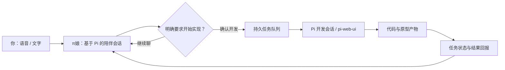

<div align="center">

# π娘 · Pi-chan

### 语音聊天，一键原型。

**基于 [Pi Coding Agent](https://github.com/earendil-works/pi) 的二次元 AI 伙伴。**  
陪你聊日常，也陪你把一个「要不试试」做出来。


**Live2D 看板娘 · Q 版桌宠 · 语音陪伴 · 从聊天到原型**

[认识 π娘](#不只是聊天框是桌面上的π娘) · [聊天到原型](#从一句话到一个原型) · [开始使用](#开始使用) · [项目网站](https://studiozhe.com/#work)

</div>

---

## 不只是聊天框，是桌面上的π娘

打开电脑，她就在桌面一角。听你说话时认真听，思考时有小动作，回答时配合语音张口——把终端里的 Agent，变成有形象、有声音、能互动的二次元伙伴。

π娘不是一套重新发明的编码引擎：**底层基于 Pi Coding Agent**，保留会话、模型选择与工具执行能力；这个项目在其上加入角色表现、语音交互、桌面陪伴，以及从聊天派发开发任务的完整入口。开发工作台集成 [pi-web-ui](https://github.com/xing-shuyin/pi-web-ui)，而非将上游工作台包装成自研。

| 她会陪你做什么 | 实现方式 |
| --- | --- |
| 聊日常，也聊突然冒出来的点子 | 文本与语音入口、持续会话、记忆模块 |
| 不止回答，还会看向你、眨眼、跟着声音动嘴 | Live2D 角色、表情与口型联动 |
| 待在桌面一角，需要时叫她 | Electron 透明桌宠、唤醒与语音控件 |
| 把「我想做一个…」接成开发任务 | 意图确认、持久任务队列、独立开发会话 |
| 做到哪一步，就告诉你哪一步 | 任务状态、来源会话绑定与完成回报 |

<details>
<summary><b>看看 Q 版π娘的动作与表情</b></summary>


这些是角色资产展示，不是开发任务完成的实机证据。
</details>

## 从一句话，到一个原型

> 「小派，想做个记录今天心情的小页面。」  
> 聊清楚想要什么，再说：「就按这个做，先给我一个原型。」

**说出想法 → 聊清需求 → 一键派发 → 后台实现 → 查看原型 → 继续聊着改。**



- **聊天不中断**：陪伴与开发是独立运行的会话，开发任务在后台推进。
- **不是口头说完成**：排队、运行、失败和完成分开记录；结果回到发起任务的聊天。
- **原型之后接着改**：在工作台查看代码与产物，再继续提出修改。

## 基于 Pi，扩展陪伴与创作入口

| 层 | 本项目 / 上游 |
| --- | --- |
| Agent 核心 | **Pi Coding Agent**，通过 RPC 接入 |
| 开发工作台 | **pi-web-ui**，固定上游版本与小范围扩展补丁 |
| 角色与陪伴 | π娘立绘、Live2D、桌宠、语音交互与表现联动 |
| 开发衔接 | 开发派发、队列、会话关联、状态与完成反馈 |
| 语音 | 本地 / 云端 ASR、TTS；独立实时音频通道 |
| 其他 | 项目记忆、MCP、可选消息平台桥接 |

陪伴会话和开发会话不是同一个上下文；独立实时音频通道也不等于 Pi 工具循环。不同模型、语音服务和硬件需要分别配置。

## Jev：让陪伴知道什么时候接话、什么时候动手

**Pi 负责对话与执行，TypeSafe Jev 负责结构化判断。** π娘把 Jev 接在交互链路中：不是再套一个聊天机器人，而是用 `choice`、`noul` 等类型化结果，让语音、角色表现与任务流程共享明确的判断信号。

| 场景 | Jev 的实际实现 |
| --- | --- |
| 你停顿了一下，还没说完 | 声学停顿后分析识别文本，区分表达中、思考中、等待补充、自我修正、已完成与不确定；前端据此继续听或提交 |
| 今天只是想聊聊 | 判断当前语气、倾听 / 庆祝 / 闲聊 / 技术回应风格与篇幅，给 Pi 本轮表达建议 |
| π娘说话时的表情 | 为台词选择情绪、强度与节奏信号，交给 Live2D / SoulLink 表现层；口型仍由语音链路驱动 |
| 聊天里突然想做一个东西 | 从当前启用的工具目录判断相关工具，区分讨论与明确执行请求；达到派发条件后接入后台开发队列 |
| 哪些内容值得记下来 | 对记忆候选进行分类、证据与冲突判断，并参与检索候选重排 |

每轮判断关联会话和输入，过期或串轮结果会被丢弃。Jev 的工具建议只作用于已有工具目录，不增加权限；原型实现仍由 Pi 开发会话完成。

实现入口、判断阈值和调用流程见 **[Jev 实现说明](docs/JEV.md)**。启用时在本机设置 `TYPESAFE_API_KEY`；相关文本与候选内容会发送到 TypeSafe 服务，仓库不含密钥。

## 开始使用

当前为面向 **Windows 本地运行** 的源码发布，包含角色运行资产；不包含语音模型权重、个人会话、录音或任何服务的 API Key。

### 1. 安装基础依赖

准备 Node.js 22.22.2 或更高的兼容版本、Python 3 和 Git。

```powershell
git clone https://github.com/zheznanohana/pi-chan.git
cd pi-chan
npm ci
npm install -g @earendil-works/pi-coding-agent@0.85.1
```

先在本机完成 Pi 的模型提供商配置，并确认 `pi` 可正常对话。API Key 由你自行配置，不随本仓库分发。

### 2. 准备开发工作台

```powershell
powershell -NoProfile -File integration/setup-workbench.ps1
```

脚本获取固定版本的 pi-web-ui、应用本项目扩展补丁并构建。上游许可证保留在其源码目录中。

### 3. 启动π娘

```powershell
python launcher.py
```

或先启动服务与桌宠：

```powershell
npm start
# 另开一个终端
npm run pet
```

本地主页：`http://127.0.0.1:31415`。在设置中配置自己的语音服务，并允许所需的麦克风权限。本地 ASR/TTS 需要另行下载兼容模型到 `models/`；可选 Python 语音后端也需独立依赖环境。

### 凭据与隐私

- 密钥通过本机配置或环境变量设置；`.env.example` 仅列空白示例，应用不会自动加载 `.env`。
- 云端语音配置保存在本机用户配置目录，Pi 的提供商凭据由 Pi 自己管理。
- `data/`、`memory/`、`integration/data/`、日志、录音、备份与模型均排除出 Git。
- 新仓库使用干净的初始历史，不带原开发目录的历史记录。
- 上线到公网前应额外审计认证、工具权限与数据边界；此项目的运行定位是个人本地桌面应用。

## 代码入口

```text
pet/                         Q 版桌宠与 Electron 窗口
live2d/                      Live2D 角色模型与运行时
assets/pet/                  π娘立绘、表情、动作资产
voice-ui.js                  语音交互
harness-server.js            Pi RPC / 主服务
development-dispatch.cjs     开发任务派发与持久队列
integration/                 工作台与可选服务桥接
.pi/extensions/              Pi 扩展
tools/                       测试与辅助工具
docs/                        发布与验证说明
```

