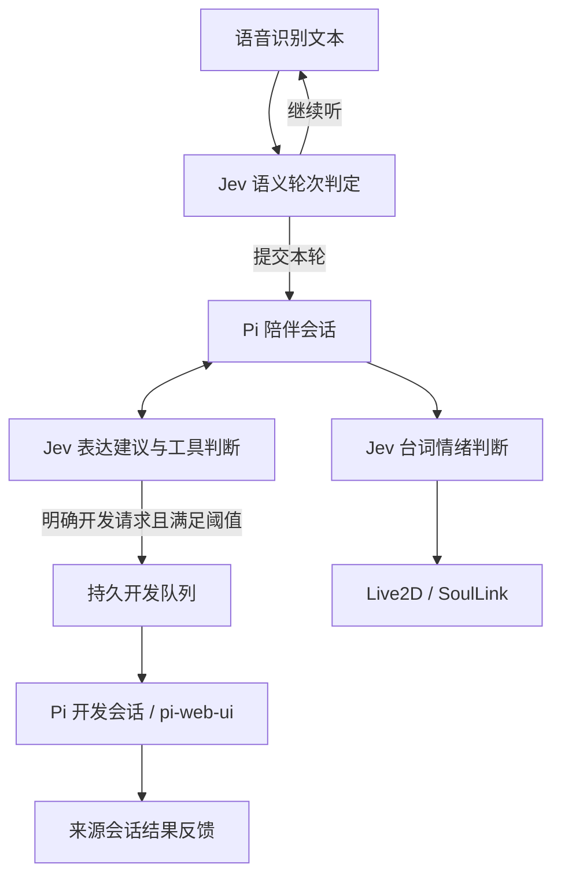

# Jev 在 π娘里的实现

## 1. 分工：判断与执行分开

`jev-agent.js` 封装 TypeSafe System One API，默认模型标识为 `jev-latest`，从环境变量 `TYPESAFE_API_KEY` 读取凭据。Pi Coding Agent 保留主对话与工具执行职责；Jev 返回结构化判断，不替代 Pi，也不负责生成整个原型。



## 2. 语音：停顿不等于说完

`jev-utterance-gate.cjs` 提供 `/api/jev/utterance`。声学停顿产生文本候选后，Jev 的 `choice` 判断返回六种状态：`expressing`、`thinking`、`awaiting_completion`、`self_correcting`、`complete`、`uncertain`。它补充语义信息，不取代 ASR 或声学 VAD。

- 服务默认预算为 800 ms，配置限制在 600–1000 ms；这是超时预算，不是实测延迟承诺。
- 置信度低于 0.65 时归为 `uncertain`；请求带 `requestId` 与输入关联信息。
- `voice-ui.js` 根据结果保留前文并等待续说，例如思考等待 6 秒、自我修正等待 4.5 秒。具体提交还受前端候选状态控制。
- 并发、取消和时间预算有边界；异常会返回明确的不可用状态，而不是伪造已说完判断。

## 3. 陪伴：这一句话需要怎样回应

`jev-companion-policy.cjs` 定义情绪、回应风格和篇幅三个 `choice` 问题。风格包括倾听、庆祝、闲聊和技术回应；0.65 以下回到默认值。判断是对当前表达的建议，不是对用户心理的诊断。

`jev-runtime.cjs` 使用 `sessionId`、`correlationId` 和输入哈希隔离轮次；建议有效期为 30 秒，异步旧结果不覆盖新轮次。`.pi/extensions/jev-companion.ts` 消费本轮建议，用户明确的表达要求仍优先。

## 4. 工具与开发：从想法到明确任务

`jev-tool-planner.cjs` 接收当前启用工具的名称和描述，用 `noul` 对每个工具的相关性评分，同时判断聊天 / 开发路由、执行层级与是否明确要求现在执行。

- 工具选择阈值：不低于 0.65 的工具入选；0.35–0.65 的不确定区间会保留原目录。
- 自动派发要求开发路由置信度至少 0.85，且 `execution_requested` 至少 0.85。
- 主服务设置工具判断预算为 1200 ms；扩展另有请求超时和结果有效期检查。
- `.pi/extensions/jev-tools.ts` 校验会话、输入哈希、目录哈希和有效期，只从当前已启用的工具中选择；轮次结束或切换会话时恢复工具集合。
- 明确开发请求通过 `dispatch_development_task` 或已验证的 Jev 派发进入 `development-dispatch.cjs`。任务使用幂等标识与来源会话绑定，防止重复执行；接受入队与完成是两种不同状态。

工具语义评分不等于执行许可。权限、审批与实际执行仍属于宿主和 Pi 工具链。

## 5. 角色：判断情绪，表现层负责动画

`jev-agent.js` 的 `directEmotion()` 分析台词与上下文，主服务通过 `/api/jev/emotion` 暴露结果。`index.html` 将判断交给 `live2d-controller.js` 与 `emotion-bridge.js`，后者接入 SoulLink。表情、动作混合与平滑由表现层完成，不是 Jev 逐帧输出动画。

回应风格判断和角色台词情绪判断是两条不同链路；音频口型也不是 Jev 生成的。

## 6. 记忆：分类、证据与冲突

`jev-memory-manager.cjs` 为候选记忆判断类别、层级、证据支持和关系。低置信度、冲突或证据不足的候选进入待审流程，而非直接覆盖已有记忆。`rerankCandidates()` 对至多 8 条检索候选做证据相关性评分，再返回排序结果。

这些判断使用远端 TypeSafe 服务。当前主服务为记忆重排接入了 `allowRemote: true`，相关查询与候选片段会出机；不是所有记忆处理都纯本地。

## 代码与验证

主要入口：`jev-agent.js`、`jev-runtime.cjs`、`jev-companion-policy.cjs`、`jev-utterance-gate.cjs`、`jev-tool-planner.cjs`、`jev-memory-manager.cjs`、`.pi/extensions/jev-tools.ts`。

可运行的离线测试入口包括：

```powershell
node --test tools/test-jev-tool-planner.cjs tools/test-jev-runtime.cjs tools/test-jev-memory-manager.cjs
```

这些测试检查状态、阈值、会话隔离与异常处理；不等于线上模型准确率或真实语音交互质量测量。
